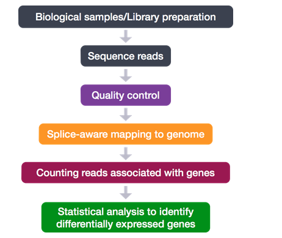

# RNA-seq workflow

## Experimental design:

1. Replicates - biological reps are more important - have at least 3,  but more is better
2. Batch effects: avoid as much as possible, but randomize your samples across the batches as much as possible 
3. Confounding variables: randomize your samples across your groups




## Read alignments:

For the RNA-Seq analysis workflow, we obtain the raw FASTQ sequencing files from the sequencing facility. We assess the quality of our sequence reads for each sample, then determine from where on the genome the reads originated by performing alignment. We will use the information about where the reads align to generate the count matrix, which we will be using to start the differential expression analysis. The counts were generated by the quantification of the number of reads aligning to the exons of each gene.

### Exploring the raw count matrix:
```{r}
smoc2_rawcounts <- read.csv("../Input_Data/fibrosis_smoc2_rawcounts_unordered.csv")

# Explore the first six observations of smoc2_rawcounts
head(smoc2_rawcounts)

# Explore the structure of smoc2_rawcounts
str(smoc2_rawcounts)

rownames(smoc2_rawcounts)<-smoc2_rawcounts[,1]
smoc2_rawcounts<-smoc2_rawcounts[,c(2:8)]
```

## Differential gene expression:

### Example dataset:


### Statistical model:

* In order to do DGE, we need an appropriate statistical model
* If there was no expression variation between biological replicates, the Poisson distribution would be appropreiate, however there is always variation.
* Therefore the negative binomial model can be used to accurately model the count data

## Preparing data for differential expression analysis:
Requirements: rawcounts, sample metadata

### Creating metadata data frame:
```{r}
# Create genotype vector
genotype <- c("smoc2_oe","smoc2_oe","smoc2_oe","smoc2_oe","smoc2_oe","smoc2_oe","smoc2_oe")

# Create condition vector
condition <- c("fibrosis","fibrosis","fibrosis","fibrosis","normal","normal","normal")

# Create data frame
smoc2_metadata <- data.frame(genotype,condition)

# Assign the row names of the data frame
rownames(smoc2_metadata) <- c("smoc2_fibrosis1","smoc2_fibrosis2","smoc2_fibrosis3","smoc2_fibrosis4","smoc2_normal1","smoc2_normal3","smoc2_normal4")
```
