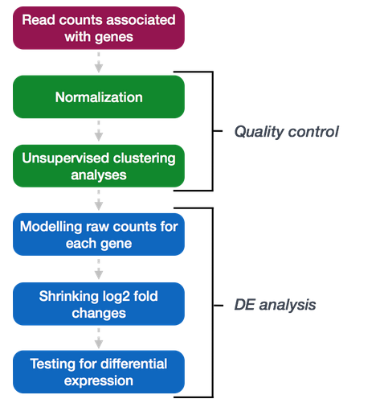

# Load dependencies:
```{r}
# Load dependencies:
# Install cran packages
list.of.packages <- c("BiocManager","dplyr")
new.packages <- list.of.packages[!(list.of.packages %in% installed.packages()[,"Package"])]
if(length(new.packages)) install.packages(new.packages)

# Install Bioconductor packages
bioc.packages <- c("DESeq2","pheatmap")
new.bioc.packages <- bioc.packages[!(bioc.packages %in% installed.packages()["Package"])]
if(length(new.bioc.packages)) BiocManager::install(new.bioc.packages)


# load dependencies
library("DESeq2")
library("pheatmap")
library("dplyr")
```

# RNA-seq DGE methods:

DESeq2, edgeR are the two most commonly used packages

limma/voom is commonly used, but may not be sensitive enough for experiments that don’t have very many biological replicates.



* Why do we use unnormalized counts as input for DESeq2? 
* DESeq2 assumes the input is raw counts and will internally correct for the library size when performing the analysis.

organizing your data: the row names of the metadata needs to be in the same order of the colnames of your raw counts data.

```{r}
# This can be checked with: 
all(rownames(smoc2_metadata) == colnames(smoc2_rawcounts))

# Matching order between vectors:
idx <- match(colnames(smoc2_rawcounts), rownames(smoc2_metadata))
reordered_smoc2_metadata <- smoc2_metadata[idx, ]
all(rownames(reordered_smoc2_metadata) == colnames(smoc2_rawcounts))   

# Creating the DeSeq2 object:
dds_smoc2 <- DESeqDataSetFromMatrix(countData = smoc2_rawcounts,                               colData = reordered_smoc2_metadata, design = ~ condition)
```

## Count normalization
need to normalize for Library size, gene length, base composition.

Gene length only needs to be normalized if you want to compare expression across different genes within the same sample.

### To calculate normalized counts:
```{r}
dds_smoc2 <- estimateSizeFactors(dds_smoc2)
sizeFactors(dds_smoc2)
```

deseq2 will use these sizefactors to normalize the raw counts

Normalized counts can then be extracted using the counts function.

```{r}
# extract the normalized counts:
normalized_smoc2_counts <- counts(dds_smoc2, normalized=TRUE)

# extract the raw counts:
raw_smoc2_counts <- counts(dds_smoc2, normalized=FALSE)
```


## Unsupervised clustering

```{r}
# Transform across the normalized counts using the variance stabilizing transformation (blind = TRUE means its blind to the sample information)
vsd_smoc2 <- vst(dds_smoc2, blind=TRUE)

# To set up the correlation heatmap:
# Extract the vst matrix from the object 
vsd_mat_smoc2 <- assay(vsd_smoc2)   
# Compute pairwise correlation values 
vsd_cor_smoc2 <- cor(vsd_mat_smoc2)   
View(vsd_cor_smoc2)


# Then use pheatmap: 
library(pheatmap)   
# Plot heatmap 
pheatmap(vsd_cor_smoc2, annotation = select(smoc2_metadata, condition))

# This is useful for identifying outliers
```

## PCA