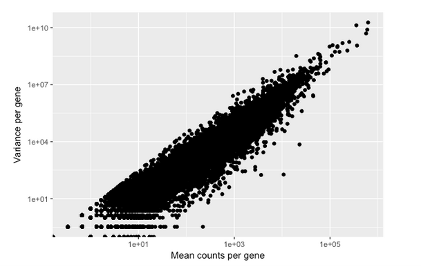
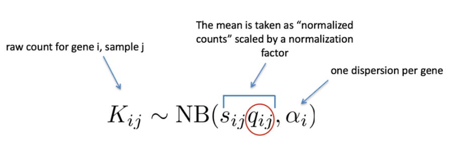
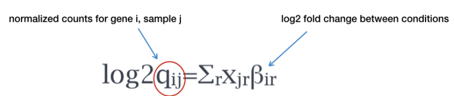

## Overview of the DE Analysis:
3 main steps of DESeq2:
1. Fit raw counts for each gene to the DESeq2 negative binomial model and testing for differential expression
2. Shrink the log2FC
3. Extracting and visualizing the results

After QC, we may need to re-create the dds object if we found additional sources of variation or if we removed outliers.

### The Design indicates the major sources of variation
If your condition of interest is treatment, it should come last in the design formula, with the other factors preceding it

You can incorporate an interaction (for example seeing how sex affects the treatment effect) into your model by doing the following:

### Design Formula
```{r}
~ strain + sex + treatment + sex:treatment
```

### Once you have your design you can run your DEseq2 analysis:
```{r}
dds_smoc2 <- DESeq(dds_smoc2)
```

## DESeq2 model-dispersion

Variance per gene increases as the mean counts per gene increases.



Var:variance
u:mean
a: dispersion
Dispersion formula: Var = u + a*u^2

Relationship between mean, variance, and dispersion:
increased variance will increase dispersion
increased means will decrease dispersion


## Plot dispersoins:

```{r}
# Plot dispersion estimates
plotDispEsts(dds_smoc2)
```

* Each black dot is a gene, with mean and dispersion values.
* Gene wise dispersion is often inaccurate. So DEseq2 uses information across all genes to create an estimate for dispersion for a gene of a given mean expression (the red line). 
* Genes with inaccurately small values of variation could yield false positives. therefore the original dispersion estimates are shrunken toward the curves (blue dots). 
* The more high dispersion values (blue circles) are not shrunken, because they may have higher variability because of true biological differences. 
* More replicates estimates the mean and variation more accurately, leading to reduced shrinkage. 
* Worrisome plots include a cloud of black dots that dont follow the red line, or dispersions that don't decrease with increasing mean expression. These are typically caused by outliers or contamination in your data


## DESeq2 model - exploring dispersions:





By default DESeq2 will use the Wald test for pair wise comparisons to test for differences in expression for the 2 conditions of interest.

### Results can be extracted by:
```{r}
results(dds_smoc2, alpha = 0.05)
#### lower alpha is more strict; 0.05 is standard
```
Note that the results are presented as normal/fibrosis, which is the opposite of what you would want to present

Therefore, you may want to specify the contrasts function, which can be added to the results function

results(dds, contrast = c("condition_factor", "level_to_compare", "base_level"),          alpha = 0.05)

### Set up the contrasts:
```{r}
smoc2_res <- results(dds_smoc2, contrast = c("condition", "fibrosis",              "normal"), alpha = 0.05)

smoc2_res
```

## DESeq2 LFC shrinkage
```{r}
# The MA plot plots the mean of normalized counts against log2 fold change.
plotMA(smoc2_res, ylim=c(-8,8))
```

# To improve the estimated fold changes, you can shrink the fold changes:
```{r}
smoc2_res <- lfcShrink(dds_smoc2, contrast=c("condition", "fibrosis", "normal"), res=smoc2_res)

# Then regenerate the MA plot:
plotMA(smoc2_res, ylim=c(-8,8))
```

#### This doesn't reduce the number of significant genes, but reduce the log2FC values


## DESeq2 Results:
```
